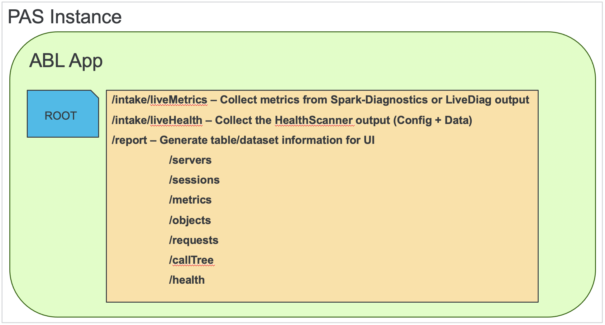

# Continuous PAS Monitoring #

## Purpose ##

PAS for OpenEdge supplies the means of collecting runtime metrics via OEJMX queries or the OEManager REST API endpoints. However, the resulting data from these endpoints represent only a single moment in time and by themselves to not provide trending data which could be useful for analysis over time. For that, we need to provide a mechanism to automatically and repeatedly collect data in a manner which is ideally both transparent to the end-user or an administrator, and does not degrade application performance.

To offer such a solution there are 2 options in this directory meant as internal, unsupported features and their deployment is dependent on the OpenEdge version in which a PAS instance runs:

- **11.7.8+** - Via the **Spark Diagnostic** library and its supporting code. *DEPRECATED*
- **12.2.4+** - Via the **LiveDiag[nostics]** debug feature in PASOE.

Due to the retirement of OpenEdge 11.7 scheduled for April 2025 the contents of this guide will focus on the 12.2 LTS and later releases. For information related to the OpenEdge 11.7 release please [view the dedicated README_OE117 document](README_OE117.md).

## Requirements ##

In order to utilize the included tooling you must have installed OpenEdge 12.2.4 at a minimum (12.2.16 is the latest as of June 2024). Please note that OpenEdge versions 12.0, 12.1, and 12.3 are not supported and it is highly recommended to upgrade to the latest OpenEdge 12.2.x LTS or OpenEdge 12.8.x LTS release if currently using those noted or earlier versions.

## Disclaimer ##

Use of these tools in a production environment is not recommended **UNLESS** they have been fully tested in a non-production environment first without observing any adverse effects. In some configurations the resulting data collected **MAY** have an impact on performance due to producing highly verbose information for collection.

## Overview ##

The **LiveDiag** solution merely requires an **OpenEdge release 12.2.4 or later** version to be installed and utilized for a PAS instance. This approach currently uses an undocumented debugging endpoint accessible only via OEJMX query to enable or disable collection. As the underlying API is not yet formalized, these actions are performed via provided batch/shell commands to help automate the process. The only configuration needed is to adjust those commands to collect the appropriate data at runtime, and to add some OpenEdge namespaced procedures and classes into the PROPATH to support the collection endpoint.

The **LiveDiag** solution has also been called the **"Pulse Metrics"** because it behaves like a heartbeat. When enabled it will ALWAYS send a payload of metrics to the collection endpoint every X seconds, regardless of whether any requests were serviced by the MSAgent process or not. This makes collection more consistent and accurate as it can report on idle MSAgent-sessions as well as in-flight requests that may cross the boundary between multiple "pulses".

Once collected, this solution is capable of sending data on a routine basis to an external location for collection (provided that network policy allows this). This endpoint is referred to here as the "**monitor**" which is a PAS instance that utilizes a custom database for storage of parsed data. All services are RESTful for both collection and reporting, and a simple UI is provided for generating user-friendly data trends.

## Differentiation ##

For reference, this solution is not the same as the [OpenEdge HealthScanner](https://docs.progress.com/bundle/pas-for-openedge-management/page/Use-the-OpenEdge-HealthScanner.html) as they differ in several key ways:

- The **OpenEdge HealthScanner** is primarily intended for production servers and is a supported, documented feature of the PAS for OpenEdge product.
- The **OpenEdge HealthScanner** reports a single, weighted score to represent the overall health of a server.
- The **LiveDiag** solution is focused on specific ABL and Tomcat metrics direct from configured PAS instances, and does not consider the host OS memory, CPU, etc.
- The **OpenEdge HealthScanner** does not retain individual measurements over time, and is meant to be an on-demand snapshot.
- The **LiveDiag** metrics are collected from across all ABL Applications in a PAS instance over time, are stored persistently, and meant for use in trend analysis.

## Installation & Usage ##

Please view the [supplemental Install guide](INSTALL.md) for detailed instructions for deployment on OpenEdge 12 or later.

## Feedback ##

During the review of this content please consider the following:

- Did you encounter any issues with the content or processes?
- Were the provided instructions clear and concise?
- What do you feel worked well during the process?
- What steps did you consider as difficult to follow?
- Opinion on the UI design (eg. could you easily locate relevant data points)?
- Any feedback on this proposed solution or its relevance to your own applications?
