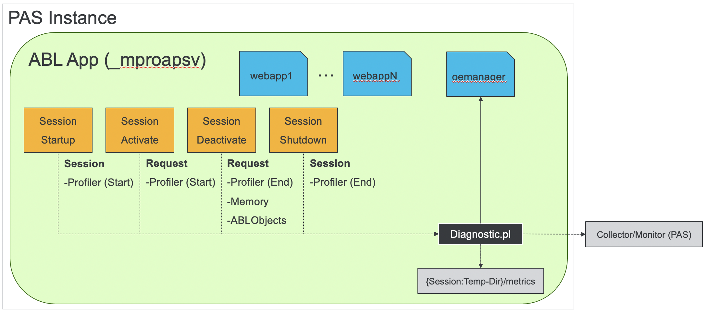
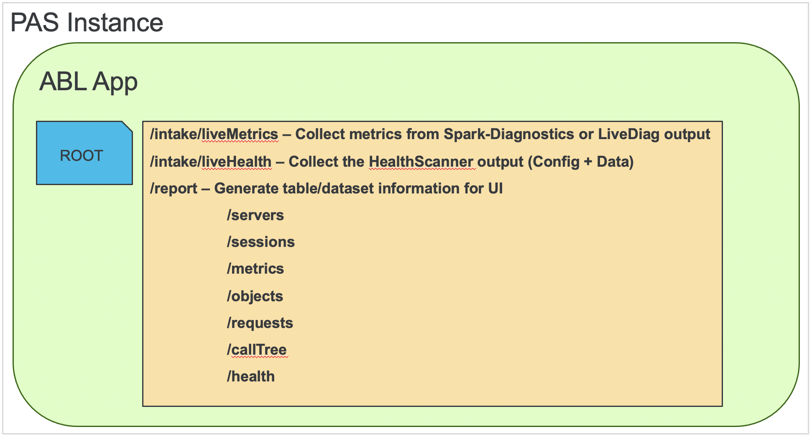

# Continuous PAS Monitoring - OpenEdge 11.7 #

## Requirements ##

In order to utilize the included tooling you must have installed OpenEdge 11.7.8 or later (ideally 11.7.13+). For OpenEdge 11.7.x the tailoring process MUST install the `oemanager` WebApp for metrics collection if it is not already deployed.

## Disclaimer ##

Use of these tools in a production environment is not recommended **UNLESS** they have been fully tested in a non-production environment first without observing any adverse effects. In some configurations the resulting data collected **MAY** have an impact on performance due to producing highly verbose information for collection.

## Overview ##

The **Spark Diagnostic** approach is intended for **OpenEdge 11.7.8+** and requires the `Diagnostic.pl` from the [Spark-Toolkit](https://github.com/progress/Spark-Toolkit) be installed and utilized for a PAS instance, with the PL file added to the PROPATH. Additionally, the `session[Startup|Activate|Deactivate|Shutdown]Proc` settings must be updated in the instance to trigger the necessary ABL logic which communicates with the OEManager webapp. Naturally, this instrumentation must work in conjunction with the existing business application and requires more configuration before it can be enabled. This is the only solution for OpenEdge 11.7.x installations (ideally 11.7.4+), and for numerous reasons is **not recommended for a production environment**.

In other words, using the **Spark-Diagnostic** solution will cause a more noticeable impact in performance of an application due to the need to request data at the end of a request boundary.

For the **Spark Diagnostic** solution there is a timeout between each push to the collection endpoint which is dependent on server activity. Meaning, the timeout is only checked when a request is made to a particular MSAgent-session, and if the timeout interval has elapsed since the last send of data then new metrics will be collected. This unfortunately creates a gap in collection if no requests are serviced by a normally-idle MSAgent-session.

Once collected, this solution is capable of sending data on a routine basis to an external location for collection (provided that network policy allows this). This endpoint is referred to here as the "**monitor**" which is a PAS instance that utilizes a custom database for storage of parsed data. All services are RESTful for both collection and reporting, and a simple UI is provided for generating user-friendly data trends.

## Differentiation ##

For reference, this solution is not the same as the [OpenEdge HealthScanner](https://docs.progress.com/bundle/pas-for-openedge-management/page/Use-the-OpenEdge-HealthScanner.html) as they differ in several key ways:

- The **OpenEdge HealthScanner** is primarily intended for production servers and is a supported, documented feature of the PAS for OpenEdge product.
- The **OpenEdge HealthScanner** reports a single, weighted score to represent the overall health of a server.
- The **Spark Diagnostic** solution is focused on specific ABL and Tomcat metrics direct from configured PAS instances, and does not consider the host OS memory, CPU, etc.
- The **OpenEdge HealthScanner** does not retain individual measurements over time, and is meant to be an on-demand snapshot.
- The **Spark Diagnostic** metrics are collected from across all ABL Applications in a PAS instance over time, are stored persistently, and meant for use in trend analysis.

## Installation & Usage ##

Please view the [supplemental Install guide](INSTALL_OE117.md) for detailed instructions for deployment on OpenEdge 11.7.